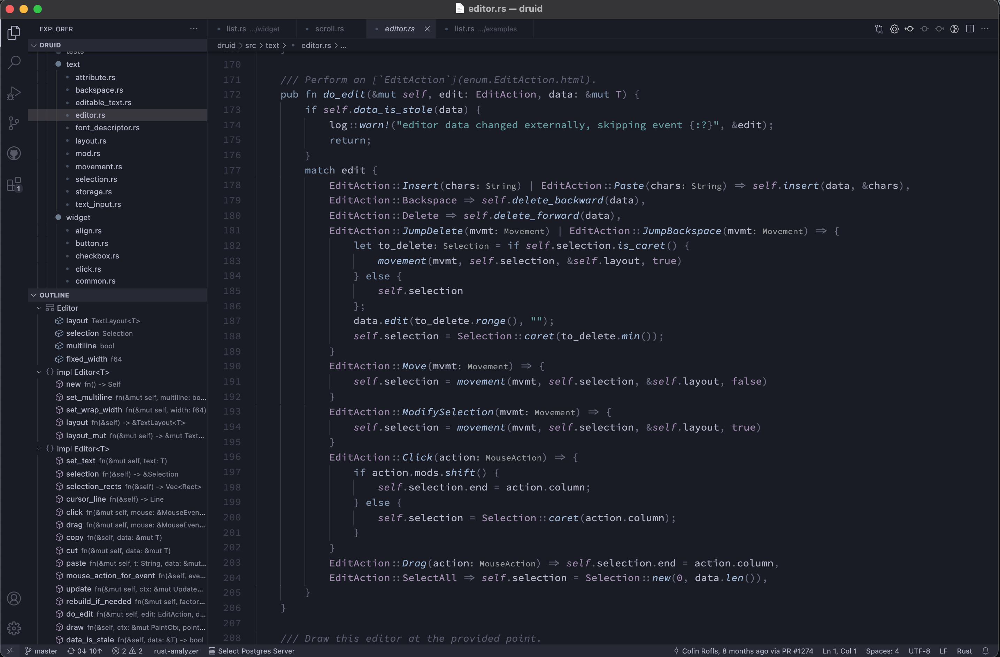
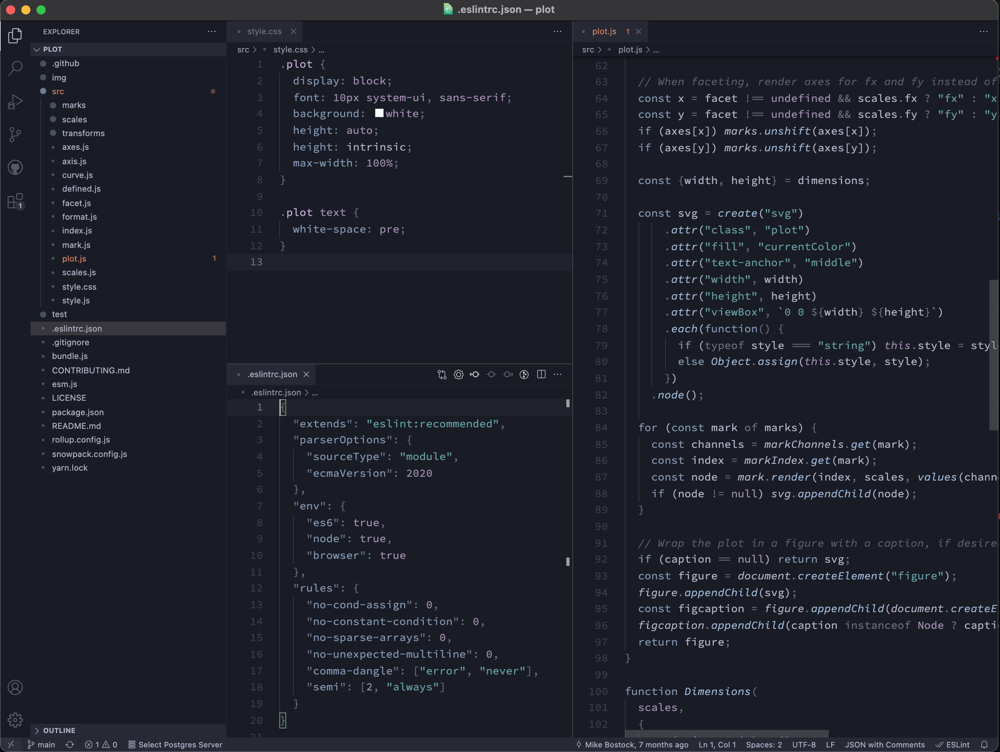
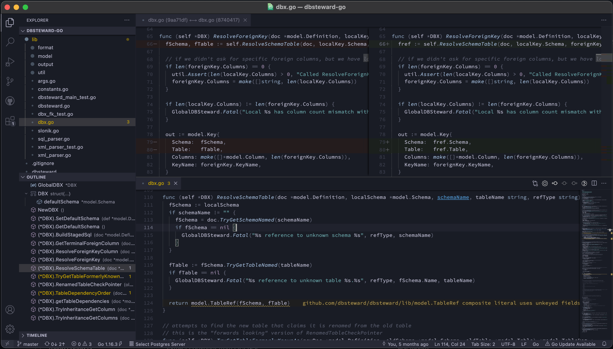
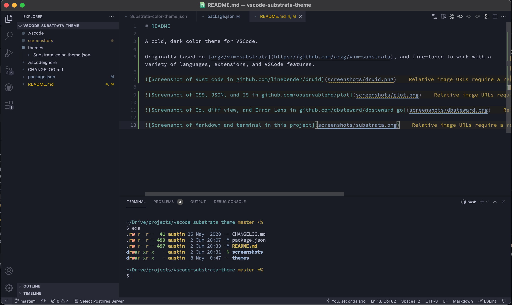

# README

A cold, dark color theme for VSCode.

Originally based on [argz/vim-substrata](https://github.com/arzg/vim-substrata), and fine-tuned to work with a variety of languages, extensions, and VSCode features.

